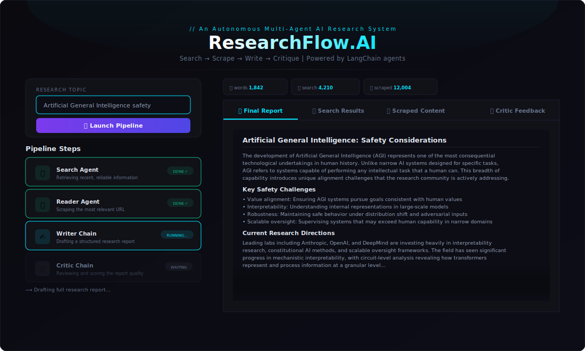

<div align="center">

# 🔬 ResearchFlow AI
### Autonomous Multi-Agent Research Pipeline

[](https://python.org)
[](https://langchain.com)
[](https://streamlit.io)
[](LICENSE)

<br/>

> **Type a topic. Four AI agents handle the rest.**  
> Search the web → Scrape top sources → Write a structured report → Critique it for quality.

<br/>



</div>

---

## ✨ What It Does

ResearchFlow is an **agentic AI pipeline** that automates deep research on any topic. Instead of one LLM call, it orchestrates four specialized agents in sequence — each with a distinct role — producing a polished, self-critiqued research report.

```
User Input ──▶ Search Agent ──▶ Reader Agent ──▶ Writer Chain ──▶ Critic Chain ──▶ Final Report
                  │                  │                 │                │
              Tavily API         Scrapes top        Structures      Reviews &
              web search           URL             findings       scores output
```

---

## 🤖 Agent Architecture

| Agent | Role | Tool Used |
|---|---|---|
| **Search Agent** | Finds recent, reliable sources on the topic | Tavily Search API |
| **Reader Agent** | Picks the best URL and deep-scrapes its content | Web scraper tool |
| **Writer Chain** | Synthesizes all findings into a structured report | LLM chain (GPT / Claude) |
| **Critic Chain** | Reviews the report for accuracy, depth, and clarity | LLM chain (GPT / Claude) |

Each agent is independently built and composed in `pipeline.py`, making the system easy to extend or swap individual components.

---

## 🗂️ Project Structure

```
researchflow-ai/
│
├── agents.py           # Agent + chain definitions (Search, Reader, Writer, Critic)
├── pipeline.py         # Core orchestration logic — wires agents into a sequence
├── tools.py            # Custom tool wrappers (search, scrape)
├── app.py              # Streamlit UI — real-time pipeline tracker + results viewer
│
├── assets/
│   └── screenshot.png  # UI screenshot for README
│
├── .env.example        # Template for required API keys
├── requirements.txt    # All dependencies
└── README.md
```

---

## 🚀 Quick Start

### 1. Clone the repo
```bash
git clone https://github.com/YOUR_USERNAME/researchflow-ai.git
cd researchflow-ai
```

### 2. Create a virtual environment
```bash
python -m venv venv
source venv/bin/activate        # macOS / Linux
venv\Scripts\activate           # Windows
```

### 3. Install dependencies
```bash
pip install -r requirements.txt
```

### 4. Set up environment variables
```bash
cp .env.example .env
```
Open `.env` and fill in your API keys:
```env
OPENAI_API_KEY=sk-...
TAVILY_API_KEY=tvly-...
```

### 5. Run the app
```bash
# Streamlit UI (recommended)
streamlit run app.py

# Or terminal mode
python pipeline.py
```

---

## 🖥️ UI Overview

The Streamlit interface is split into two panels:

**Left panel — Control & Pipeline Tracker**
- Topic input field
- Live step-by-step agent status (`WAITING → RUNNING… → DONE ✓`)

**Right panel — Results**
- Stat strip (word count, data ingested)
- Four tabs: Final Report · Search Results · Scraped Content · Critic Feedback
- One-click report download

---

## 🛠️ Tech Stack

| Layer | Technology |
|---|---|
| Agent Framework | [LangChain](https://langchain.com) |
| Web Search | [Tavily API](https://tavily.com) |
| LLM Backend | OpenAI GPT-4o (swappable) |
| UI | [Streamlit](https://streamlit.io) |
| Language | Python 3.10+ |

---

## 🔧 Configuration

You can swap the LLM backend in `agents.py`:

```python
# Default — OpenAI
from langchain_openai import ChatOpenAI
llm = ChatOpenAI(model="gpt-4o")

# Switch to Anthropic Claude
from langchain_anthropic import ChatAnthropic
llm = ChatAnthropic(model="claude-3-5-sonnet-20241022")
```

---

## 📋 Requirements

```
langchain
langchain-openai
langchain-community
tavily-python
streamlit
python-dotenv
```

See `requirements.txt` for pinned versions.

---

## 🗺️ Roadmap

- [ ] Add memory / conversation history between runs
- [ ] Export reports as PDF
- [ ] Support multiple URLs per research run
- [ ] Add a confidence score to the critic output
- [ ] Deploy to Streamlit Cloud with one-click template

---

## 📄 License

MIT — free to use, modify, and distribute.

---

<div align="center">
  <sub>Built with LangChain · Streamlit · Python</sub>
</div>
